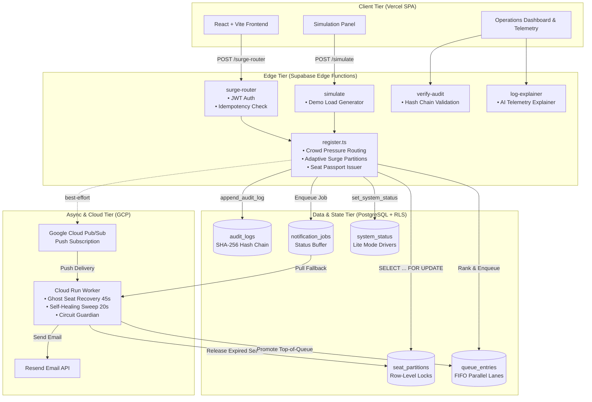
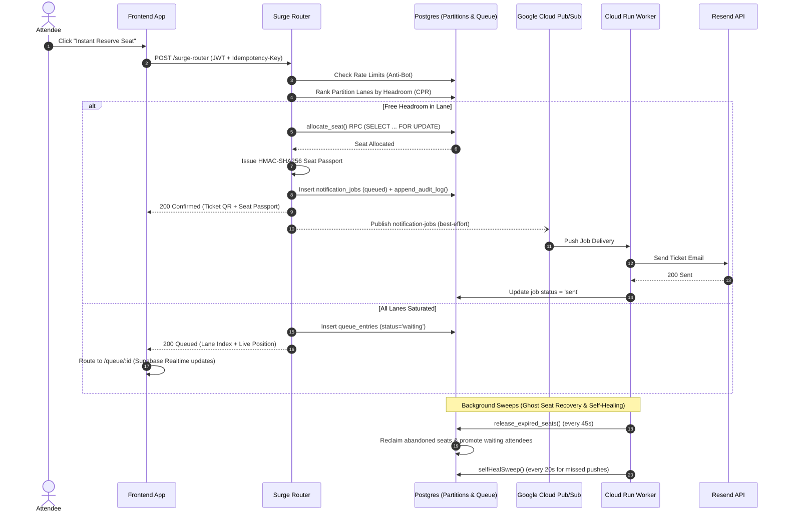
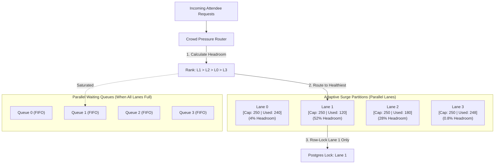
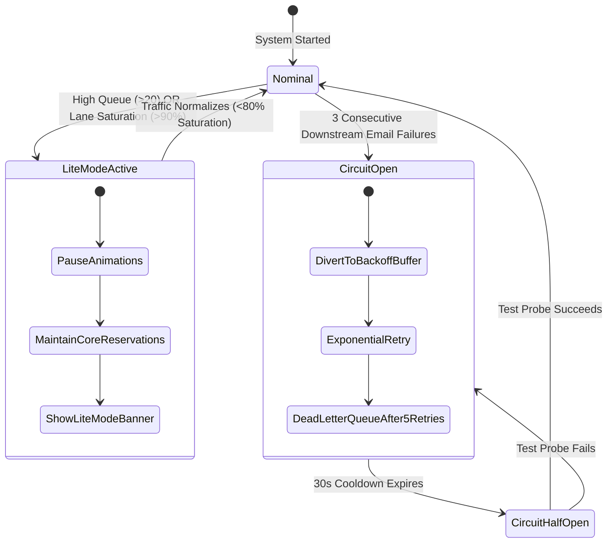
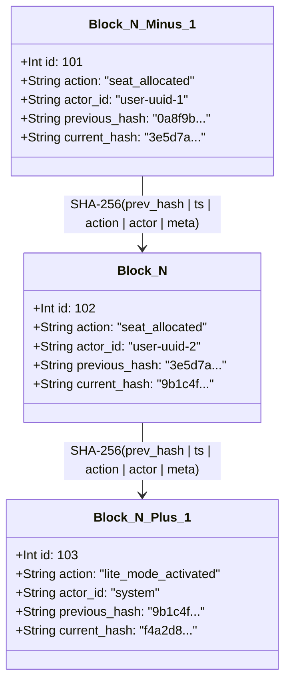

# SurgeShield Architecture & System Diagrams

## 1. End-to-End System Architecture

---

## 2. Sequence Flow: Registration, Surges & Fallback Recovery

---

## 3. Adaptive Surge Partitions & Crowd Pressure Routing

---

## 4. Circuit Guardian & Lite Mode State Machine

---

## 5. Tamper-Evident Hash Chain Structure

