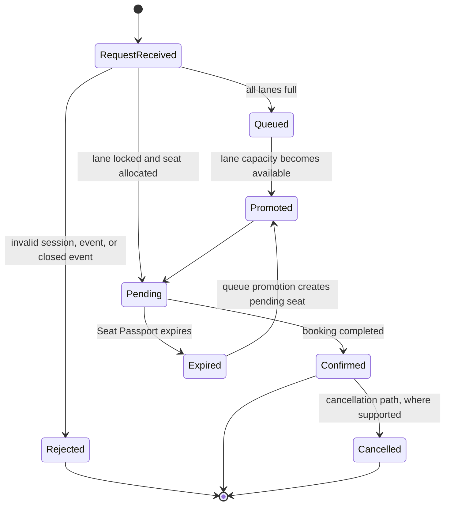

# Solution Overview

## Business Problem

High-demand event registration creates a short, hostile workload: many users compete for a finite inventory, retries amplify traffic, and non-critical services can consume the capacity needed for the allocation path. A read-then-write counter is not sufficient because concurrent requests can oversell the last seat.

SurgeShield separates the critical reservation transaction from asynchronous notifications and operational telemetry. It uses parallel registration lanes, database-enforced locking, temporary Seat Passports, a waiting queue, and recovery loops to preserve correctness during a surge.

## Personas

| Persona | Goal | Relevant capability |
|---|---|---|
| Attendee | Obtain a fair reservation or queue position | Authenticated registration, Seat Passport, queue status |
| Organizer | Publish events and understand system health | Organizer dashboard, metrics, audit verification |
| Operator | Diagnose degradation without touching seat state | Operations dashboard, Log Explainer, Lite Mode, Circuit Guardian |
| Evaluator | Verify the engineering argument | Simulation, diagrams, audit chain, deployment scripts |

## Functional Scope

The current implementation includes event browsing, Supabase Auth sessions, attendee and organizer profiles, event registration, partitioned seat inventory, FIFO lane queues, temporary HMAC Seat Passports, confirmation jobs, worker recovery, operations metrics, audit verification, and a demo-only simulator. The simulator is JWT-protected and requires `DEMO_MODE=true`.

## User Journey

1. An attendee authenticates and receives a Supabase session.
2. The event page sends `event_id` and an idempotency key to `surge-router`.
3. Crowd Pressure Routing ranks available registration lanes by headroom.
4. PostgreSQL locks the selected lane and either creates a pending registration or reports that the lane is full.
5. If every lane is full, the attendee joins the shortest waiting lane and lane switching is prohibited.
6. A successful allocation receives a short-lived HMAC Seat Passport and a queued notification job.
7. The worker sends the confirmation asynchronously. Expired pending reservations release inventory and trigger queue promotion.

## Registration Lifecycle

See [SYSTEM_ARCHITECTURE.md](SYSTEM_ARCHITECTURE.md), [SEQUENCE_DIAGRAMS.md](SEQUENCE_DIAGRAMS.md), and [EDGE_CASES.md](EDGE_CASES.md) for the detailed design.
