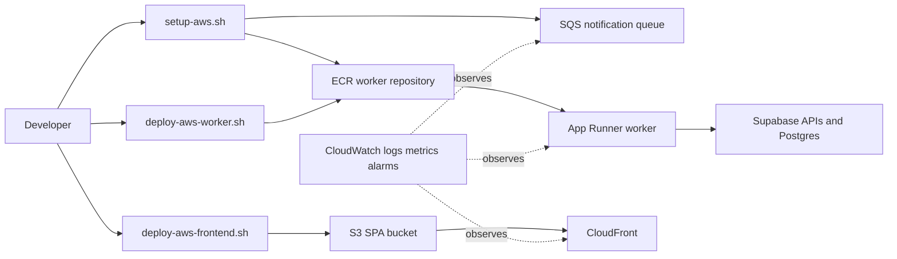

# AWS Deployment

## Scope

The existing AWS track deploys the current React/Vite frontend and Node.js worker without redesigning the Supabase registration authority. Supabase PostgreSQL/Auth/Edge Functions remain the transactional backend. AWS supplies frontend hosting and an App Runner worker deployment; SQS is the AWS notification integration target.

[Editable AWS architecture diagram](diagrams/aws_architecture.mmd)

## Resource Mapping

| Resource | Current repository use |
|---|---|
| Amazon ECR | `setup-aws.sh` creates `surgeshield-worker` with scan-on-push and the worker deployment pushes the image. |
| AWS App Runner | `deploy-aws-worker.sh` runs the container on port 8080 and passes worker environment variables. |
| Amazon S3 | `deploy-aws-frontend.sh` syncs `frontend/dist` to the supplied bucket. |
| CloudFront | The frontend script optionally invalidates a distribution; create/configure the distribution separately. |
| Amazon SQS | `setup-aws.sh` creates `surgeshield-notification-jobs` with 14-day retention and 60-second visibility timeout. `worker/aws-sqs.js` is a guarded polling adapter stub; it is not currently started by `worker/index.js`. |
| CloudWatch | Use App Runner, SQS, CloudFront, and application logs/metrics as the AWS observability surface. The scripts do not provision alarms or dashboards. |

## Deployment Flow

1. Install and authenticate the AWS CLI, Docker, and Node.js.
2. Set `AWS_REGION`; run `./scripts/setup-aws.sh`. It writes `scripts/.aws-state`, which must remain untracked.
3. Configure worker secrets in `worker/.env` without committing the file.
4. Run `./scripts/deploy-aws-worker.sh` to build, scan/push, and create or update App Runner.
5. Set `VITE_SUPABASE_URL`, `VITE_SUPABASE_ANON_KEY`, and `VITE_SUPABASE_FUNCTIONS_URL` for the frontend build.
6. Create an S3 bucket and CloudFront distribution with SPA fallback behavior, then run `./scripts/deploy-aws-frontend.sh <bucket> <distribution-id>`.
7. Configure CloudWatch alarms and perform the live verification sequence in [README.md](../README.md).

## Scaling and Cost Controls

Use App Runner's managed scaling for the worker, keep the container stateless, and let the database-backed job table remain the recovery source. SQS should use a dead-letter queue and visibility timeout aligned with the worker's maximum processing time before enabling the adapter. S3 plus CloudFront is inexpensive for a static SPA, but configure cache invalidation deliberately.

## Important Caveat

Do not claim that the AWS SQS path is end-to-end until the worker starts `startAwsSqsConsumer`, receives a job contract, deletes messages after successful processing, and has integration tests. The current production-like primary path uses the notification table plus the existing push/self-heal behavior.
